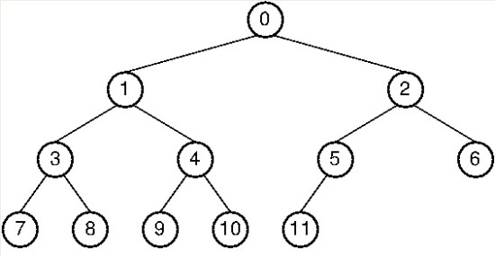

# [프로그래머스] 길찾기 게임

### 1. 트리란

- 1개 이상의 유한한 개수의 노드의 집합
- 루트 노드와 0개 이상의 겹치지 않는 하위 나무 구조들의 집합으로 이루어짐


### 2. 이진트리란

- 모든 내부 node들이 둘 이하의 자삭node를 갖는 나무, 노드가 하나도 없는 공집합이거나 root node를 기준으로 왼쪽 이진나무, 오른쪽 이진나무로 이루어진 집합
- 전위 순회(preorder) : 뿌리(root)를 먼저 방문 후 왼쪽 자식먼저(뿌리->왼쪽자식->오른쪽자식)
- 중위 순회(inorder) : 왼쪽 하위 트리를 방문 후 root를 방문(왼쪽자식->뿌리->오른쪽자식)
- 후위 순회(postorder) : 하위 트리 모두 방문후 root를 방문(왼쪽자식->오른쪽자식->뿌리)



```
전위 순회 : 0->1->3->7->8->4->9->10->2->5->11->6

중위 순회 : 7->3->8->1->9->4->10->0->11->5->2->6

후위 순회 : 7->8->3->9->10->4->1->11->5->6->2->0
```


### 3. 문제풀이

- y값 기준으로 큰 것부터 정렬, 같으면 x가 작은 것부터!
- 노드를 연결(Class의 프로퍼티에 left, right에 넣기)
- 재귀함수를 통해 전위 순회 및 후위 순회 실시


### 4. 코드

```java
import java.util.*;
class Solution {
    static ArrayList<node> list;
	static ArrayList<Integer> prelist;
	static ArrayList<Integer> postlist;
    public int[][] solution(int[][] nodeinfo) {
        int[][] answer = new int[2][nodeinfo.length];
        list = new ArrayList<>();
        prelist = new ArrayList<>();
        postlist = new ArrayList<>();
        for (int i = 0; i < nodeinfo.length; i++) {
			list.add(new node(i+1,nodeinfo[i][0], nodeinfo[i][1]));
		}

        //정렬
        Collections.sort(list);

        //연결 노드 만들기
        for (int i = 1; i < list.size(); i++) {
			makeLink(list.get(0), list.get(i));
		}
        
        //전위 순회
        preorder(list.get(0));
        //후위 순회
        postorder(list.get(0));
        
        //정답 넣기
        for (int i = 0; i < answer[0].length; i++) {
			answer[0][i] = prelist.get(i);
			answer[1][i] = postlist.get(i);
		}
       
        return answer;
    }
	static void preorder(node n) {
		if(n==null) return;
		
		prelist.add(n.id);
		preorder(n.left);
		preorder(n.right);
	}
	static void postorder(node n) {
		if(n==null) return;
		
		postorder(n.left);
		postorder(n.right);
		postlist.add(n.id);
	}
	static void makeLink(node root, node n) {
		//x가 같은 노드는 존재하지 않음
		if(n.x<root.x) {
			if(root.left==null) {
				root.left = n; 
				return;
			}
			makeLink(root.left, n);	
		}else {
			if(root.right==null) {
				root.right = n;
				return;
			}
			makeLink(root.right, n);
		}
	}
}
class node implements Comparable<node>{
	int id;
	int x;
	int y;
	node left;
	node right;

	public node(int id, int x, int y) {
		this.id = id;
		this.x = x;
		this.y = y;
	}

	@Override
	public String toString() {
		return "node [id=" + id + ", x=" + x + ", y=" + y + ", left=" + left + ", right=" + right + "]";
	}

	@Override
	public int compareTo(node o) {
		if(this.y==o.y) return this.x-o.x;
		return o.y-this.y;
	}
}
```

