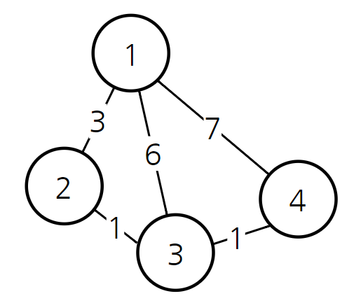
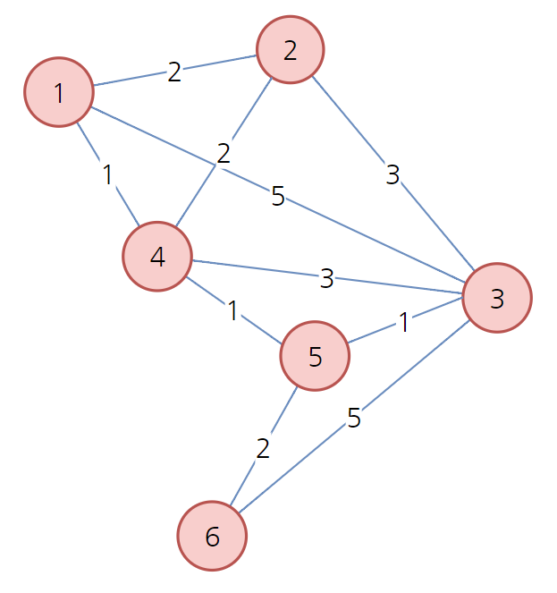
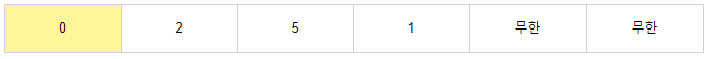
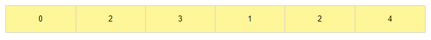

# 다익스트라

- DP를 활용한 최단 경로 탐색 알고리즘입니다.
- 인공위성이나 GPS 소프트웨어 등에서 많이 사용됩니다.
- 특정한 하나의 정점에서 다른 모든 정점에서 가는 최단 경로를 알려줍니다.
- 다만 음의 간선이 존재하면 사용할 수 없습니다.
- 하나의 최단 거리를 구할 때 그 이전까지 구했던 최단 거리 정보를 그대로 사용한다는 특징이 있습니다.
- 시간복잡도는 O(N * logN)
- 두 정점 사이에 하나의 간선만 존재할 때 구현한 코드입니다. 여려개가 존재할 때에는 간선을 ArrayList형태로 관리하여아 합니다.


### 1. 방법

- 출발 노드를 설정합니다.
- 출발 노드를 기준으로 각 노드의 최소 비용을 저장합니다.
- 방문하지 않은 노드 중에서 가장 비용이 적은 노드를 선택 합니다.
- 해당 노드를 거쳐서 특정한 노드로 가는 경우를 고려하여 최소 비용을 갱신합니다.
- 위과정을 3~4번 반복합니다.
- 예시 ( 1의 정점을 기준으로 다익스트라 구하기 )



- 컴퓨터는 1에서 3으로 가는 비용을 6으로만 알 수 있습니다. ( 인접 행렬 )
- 나중에 2번 경로를 탐색하면서 1 => 3으로 가는 경우 최소비용이 4라는 것을 알게 됩니다.
- 현재까지 알고 있던 최단 경로를 계속해서 갱신해 나가는 알고리즘 입니다.


### 2. 예시









### 3. 소스코드

```java
public class Study {
	static int INF = 100000000;
	public static void main(String[] args) throws NumberFormatException, IOException {
		// Table로 명시해줍니다. ( 인접 행렬 )
		int[][] node = {
			{0, 2, 5, 1, INF, INF},
			{2, 0, 3, 2, INF, INF},
			{5, 3, 0, 3, 1, 5},
			{1, 2, 3, 0, 1, INF},
			{INF, INF, 1, 1, 0, 2},
			{INF, INF, 5, INF, 2, 0},
		};
		
		// 다익스트라 구할 정점
		int start = 0;
		
		// 방문을 한 노드인지 체크해주는 배열
		boolean[] check = new boolean[6];
		
		// 최소 거리를 저장하는 배열 - 시작점은 0번
		int[] distance = node[start].clone();
		
		//다익스트라 시작
		check[start] = true;
		
        // 자기자신과 마지막 정점 제외
		for (int i = 0; i < distance.length - 2; i++) {
		
			// 가장 최소 거리를 가지는 정점을 반환
			int index = 0;
			int min = INF;
			for (int j = 0; j < distance.length; j++) {
				if(distance[j] < min && !check[j]) {
					min = distance[j];
					index = j; //위치기억 최소거리
				}
			}
			
			
			int current = index;
			// 노드 방문처리 및 선택
			check[current] = true;
			
			for (int j = 0; j < distance.length; j++) {
				// 노드를 방문하지 않았다면
				if(!check[j]) {
					if(distance[current] + node[current][j] < distance[j]) {
						distance[j] = distance[current] + node[current][j];
					}
				}
			}
		}
		
		System.out.println(Arrays.toString(distance));
	}
}
```

- 문제점 : 시간 복잡도가 O(N^2)으로 형성됩니다. 선형탐색으로 최소 거리를 가지는 정점을 찾기 때문에..


### 3. 우선순위 큐를 활용한 소스코드

```java
import java.io.BufferedReader;
import java.io.IOException;
import java.io.InputStreamReader;
import java.util.ArrayList;
import java.util.Arrays;
import java.util.Collections;
import java.util.PriorityQueue;
import java.util.Scanner;

public class Study {
	static int INF = 100000000;
	public static void main(String[] args) throws NumberFormatException, IOException {
		
		int[][] node = {
			{0, 2, 5, 1, INF, INF},
			{2, 0, 3, 2, INF, INF},
			{5, 3, 0, 3, 1, 5},
			{1, 2, 3, 0, 1, INF},
			{INF, INF, 1, 1, 0, 2},
			{INF, INF, 5, INF, 2, 0},
		};
		
		// 다익스트라 구할 정점
		int start = 0;
		
		// 최소 거리를 저장하는 배열 - 시작점은 0번
		int[] distance = new int[6];
		boolean[] check  = new boolean[6];
		Arrays.fill(distance, INF);
		
		distance[start] = 0;

		PriorityQueue<Edge> pq = new PriorityQueue<>();
		pq.add(new Edge(start, distance[start]));
		
		while(!pq.isEmpty()) {
			int current = pq.poll().v;
			
			// 이미 한번 찾은 정점은 패스
			if(check[current]) continue;
			check[current] = true;
			
			// pq에서 꺼낸 정점으로 부터 갈 수 있는 곳을 다 가보면서 갱신한다.
			for (int i = 0; i < distance.length; i++) {
				if(distance[i] > distance[current] + node[current][i]) {
					distance[i] = distance[current] + node[current][i];
					pq.add(new Edge(i, distance[i]));
				}
			}
		}
		
		System.out.println(Arrays.toString(distance));
	}
}
class Edge implements Comparable<Edge>{
	int v;
	int weight;
	
	public Edge(int v, int weight) {
		this.v = v;
		this.weight = weight;
	}

	@Override
	public int compareTo(Edge o) {
		return this.weight-o.weight;
	}

	@Override
	public String toString() {
		return "Edge [v=" + v + ", weight=" + weight + "]";
	}
	
}
```

- 인접행렬로 구현하면 메모라 초과하는 경우가 발생합니다.


#### 4. 인접 리스트로 구현( 백준 1753 )

- 응용 문제 : https://programmers.co.kr/learn/courses/30/lessons/12978?language=java

```java
import java.io.BufferedReader;
import java.io.BufferedWriter;
import java.io.IOException;
import java.io.InputStreamReader;
import java.io.OutputStreamWriter;
import java.util.ArrayList;
import java.util.Arrays;
import java.util.PriorityQueue;
import java.util.StringTokenizer;

public class Study {
	static StringTokenizer st;
	static int n, m, start;
	static int INF = 987654321;
	static ArrayList<ArrayList<Edge>> list;
	public static void main(String[] args) throws IOException {
		
		BufferedReader br = new BufferedReader(new InputStreamReader(System.in));
		BufferedWriter bw = new BufferedWriter(new OutputStreamWriter(System.out));
		
		st = new StringTokenizer(br.readLine());
		n = Integer.parseInt(st.nextToken());
		m = Integer.parseInt(st.nextToken());
		start = Integer.parseInt(br.readLine())-1;
		
		list = new ArrayList<>();
		
		for (int i = 0; i < n; i++) {
			list.add(new ArrayList<>());
		}
		
		for (int i = 0; i < m; i++) {
			st = new StringTokenizer(br.readLine());
			int first = Integer.parseInt(st.nextToken());
			int second = Integer.parseInt(st.nextToken());
			int weight = Integer.parseInt(st.nextToken());
			
			list.get(first-1).add(new Edge(second-1, weight));
		}
		// 입력 끝
		
		boolean[] check = new boolean[n];
		int[] distance = new int[n];
		Arrays.fill(distance, INF);
		distance[start] = 0;
		
		PriorityQueue<Edge> pq = new PriorityQueue<>();
		pq.add(new Edge(start, 0));
		
		while(!pq.isEmpty()) {
			int current = pq.poll().idx;
			
			if(check[current]) continue;
			check[current] = true;
			
			for (int i = 0; i < list.get(current).size(); i++) {
				Edge edge = list.get(current).get(i);
				if(distance[edge.idx] > distance[current]+edge.value) {
					distance[edge.idx] = distance[current]+edge.value;
					pq.add(new Edge(edge.idx, distance[edge.idx]));
				}
			}
		}
		

		
		for (int i = 0; i < distance.length; i++) {
	
			int result = distance[i];
			if(result!=INF) {
				bw.write(distance[i]+"");
			}else {
				bw.write("INF");
			}
			bw.newLine();
			
		}
		
		bw.flush();
		bw.close();
	}
}
class Edge implements Comparable<Edge> {
	int idx;
	int value;
	
	public Edge(int idx, int value) {
		this.idx = idx;
		this.value = value;
	}

	@Override
	public int compareTo(Edge o) {
		return this.value-o.value;
	}

	@Override
	public String toString() {
		return "Edge [idx=" + idx + ", value=" + value + "]";
	}
}
```

