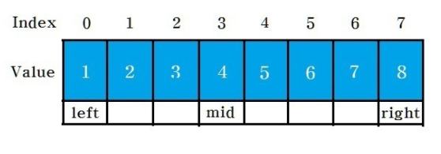
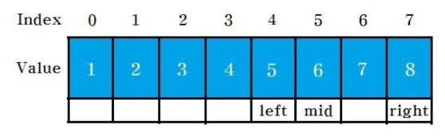
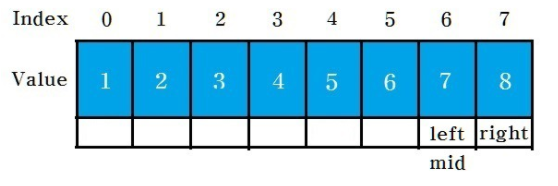

# 이분 탐색(Binaray Search)

- **오름차순으로 정렬**된 리스트에서 특정 값의 위치를 찾는 알고리즘입니다.
- 모든 값을 순회하는 일반적인 Search보다 더 빠르다는 장점이 있습니다.
- 중앙값을 바탕으로 비교
  - 중앙값 > 찾는 값 : 중앙 값 기준으로 왼쪽을 탐색
  - 중앙값 < 찾는 값 : 중앙 값 기준으로 오른쪽을 탐색


### 1. 이분 탐색 방법

- left를 0, right를 검색하는 리스트(배열)의 마지막 원소의 인덱스로 초기화 합니다.
- mid 변수에 (left+right)/2로 설정합니다.
- 위의 과정을 반복하며 값을 찾지 못할 경우 left>right 되는 순간 탐색을 종료합니다.
- ex) **1~8**의 배열에서 **7** 찾아보기



- **left** = 0, **right** = 7, **mid**((left+right)/2) = 3

- `mid : 5 <  우리가 찾는 값 : 7` => **left** = mid+1 / **mid** =  (left+right)/2 = 5



- `mid : 6 <  우리가 찾는 값 : 7` => **left** = mid+1 / **mid** =  (left+right)/2 = 6



- **mid == 7**, 리가 찾는 값이므로 탐색 종료


### 2. 시간 복잡도

- O(logN)


### 3. 소스코드

- https://www.acmicpc.net/problem/1920
- https://www.acmicpc.net/problem/3079 ( 심화 )

```java
class Solution {
	
	public static void main(String[] args) {
		int[] arr = { 1, 2, 3, 4, 5, 6, 7, 8, 9 };
		 
        binarySearch(3, arr);

	}
	static void binarySearch(int key, int arr[]) {
		int mid = 0;
		int left = 0;
		int right = arr.length-1;
		
		while(left<=right) {
			mid = (left+right)/2;
			
			if(arr[mid]==key) {
				System.out.println("값 찾음 : "+mid);
				break;
			}
			
			if(key<arr[mid]) {
				right = mid - 1;
			}else {
				left = mid + 1;
			}
			
		}
	}

}
```

