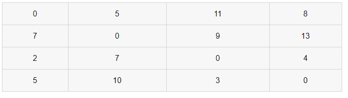

# 플로이드 와샬

- 모든 정점에서 다른 모든 정점으로 최단 거리를 구하는 알고리즘입니다.
- 거쳐가는 정점을 기준으로 알고리즘을 수행합니다.
- DP기반 프로그래밍 입니다.
- 시간 복잡도는 3개의 반복문을 통해 O(n^3)를 가집니다.
- 음 수 가중치를 갖는 간선만 없으면 잘 처리 됩니다.
- 첫번째 반복문은 거쳐가는 꼭짓점, 두번째 반복문은 출발하는 꼭짓점, 세번째 반복문은 도착하는 꼭짓점
- 2660번 회장뽑기, 1956번 운동, 1613번 역사, 10159번 저울, 1238번 파티, 1389번 케빈 베이컨의 6단계 법칙


- 예시 데이터
  - 당장 바로 갈 수 없는 경우는 무한대, 자기 자신은 0으로 넣어줍니다.


- **거쳐가는 경우**를 기준으로 반복


### 1. 노드 1을 거쳐가는 경우


- 원래 2에서 3으로 가는 비용은 9 vs 2에서 1로가는 비용 7 +1에서 3으로가는 비용은 무한
  - 1을 거쳐가는 특징 : **7+무한 > 기존 비용 9** = 갱신할 필요가 없어집니다.
- **공식** : X에서 Y로 가는 최소 비용 VS X에서 노드 1로 가는 비용 + 노드 1에서 Y로가는 비용


### 2. 노드 2를 거쳐가는 경우

- 거쳐가는 부분만 확인하면 됩니다.


### 3. 모두 완료된 배열




### 4. 소스코드

- 응용 문제 : https://programmers.co.kr/learn/courses/30/lessons/49191

```java
public class Study {
	
	public static void main(String[] args) {
		
		int number = 4;
		int INF = 100000000;
		 
		int[][] arr = {{0, 5, INF, 8}, {7, 0, 9, INF}, {2, INF, 0, 4}, {INF, INF, 3, 0}};
		
		//그래그  초기화
		int[][] d = new int[number][number];
		
		for (int i = 0; i < number; i++) {
			for (int j = 0; j < number; j++) {
				d[i][j] = arr[i][j];
			}
		}
		
		// k = 거쳐가는 노드
		for (int k = 0; k < number; k++) {
			// i = 출발 노드
			for (int i = 0; i < number; i++) {
				// j = 도착 노드
				for (int j = 0; j < number; j++) {
					if(d[i][k] + d[k][j] < d[i][j]) {
						d[i][j] = d[i][k] + d[k][j];
					}
				}
			}
		}
		
		//결과를 출력합니다.
		for (int i = 0; i < number; i++) {
			for (int j = 0; j < number; j++) {
				System.out.print(d[i][j]+" ");
			}
			System.out.println();
		}
				
	}
}
```

