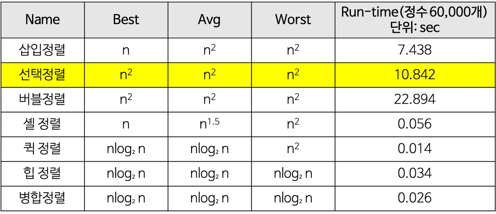

# Quick Sort ( 퀵 정렬 )

- 불안전 정렬에 속하며 다른 원소와의 비교만으로 정렬을 수행하는 비교 정렬에 속합니다.
- 분할 정복 알고리즘의 하나로 평균적으로 매우 빠른 수행 속도를 자랑하는 정렬 방법입니다.
  - 합병 정렬과 달리 퀵 정렬은 리스트를 비균등하게 분할 합니다.


### 1. 구현 방법

- 하나의 리스트를 피벗(pivot)을 기준으로 두 개의 비균등한 크기로 분할하고 분할된 부분 리스트를 정렬한 다음, 두 개의 정렬된 부분 리스트를 합하여 전체가 정렬된 리스트가 되게 하는 방법입니다.
- 단계
  - 분할 : 입력 배열을 피벗을 기준으로 비균등하게 2개의 부분 배열로 분할합니다.
  - 정복 : 부분 배열을 정렬합니다. 부분 배열의 크기가 충분히 작지 않으면 순환 호출을 이용하여 다시 분할 정복 방법을 적용합니다.
  - 결합 : 정렬된 부분 배열들을 하나의 배열에 합병합니다.
- 순한 호출이 한번 진행될 때마다 최소한 하나의 원소(피벗)은 최종적으로 위치가 정해지므로 이 알고리즘은 반드시 끝난다는 것을 보장할 수 있습니다.


- 피벗 값을 입력 리스트의 첫 번째 데이터로 합니다. ( 다른 임의값도 괜찮습니다. )
- 2개의 인덱스 변수(low, high)를 이용해서 리스트를  두 개의 부분 리스트로 나눕니다.
- 1회전 :피벗이 5인 경우
  - low는 왼쪽에서 오른쪽으로 탐색해가다가 피벗보다 큰 데이터(8)을 찾으면 멈춥니다.
  - high는 오른쪽에서 왼쪽으로 탐색해가다가 피벗보다 작은 데이터(2)를 찾으면 멈춥니다.
  - low와 hight가 가리키는 두 데이터를 서로 교환합니다.
  - 이 탐색-교환 과정은 low와 high가 엇갈릴 때까지 반복합니다.
- 2회전 : 피벗이 1인 경우
  - 위와 동일한 방법으로 반복합니다.
- 3회전 : 피벗이 0인 경우
  - 위와 동일한 방법으로 반복합니다.


### 2. 특징

- 장점
  - 속도가 매우 빠릅니다.
    - 시간 복잡도가 O(nlog₂n)를 가지는 다른 정렬 알고리즘과 비교했을 때도 가장 빠릅니다.
  - 추가 메모리 공간이 필요하지 않습니다.
    - 퀵 정렬은 O(log n)만큼의 메모리를 필요합니다.
- 단점
  - 정렬된 리스트에 대해서는 퀵 정렬의 불균형 분할에 의해 오히려 수행시간이 더 많이 걸릴 수 있습니다.
    - 퀵 정렬의 불균형 분할을 방지하기 위해 피벗을 선택할 때 더욱 리스트를 균등하게 분할할 수 있는 데이터를 선택합니다. ( 중간값을 피벗으로 선택 ) 


### 3. 시간 복잡도

- 최선의 경우 : O(nlogn)
- 최악의 경우 : O(n^2)
  - 리스트가 계속 불균형으로 나누어지는 경우
  - 이미 정렬된 리스트에 대하여 퀵 정렬 하는 경우
- 평균 : O (nlog₂n)
  - 시간 복잡도 O(nlogn)을 가지는 다른 정렬 알고리즘과 비교했을 때에도 가장 빠릅니다.
    - 퀵 정렬이 불필요한 데이터의 이동을 줄이고 먼 거리의 데이터를 교환할 뿐만 아니라, 한번 결정된 피벗들이 추 후 연산에서 제외되는 특성 때문입니다.
- 공간 복잡도 : 주어진 배열 안에서 교환(swap)을 통해, 정렬이 수행되므로 **O(n)**이다.




### 4. 소스코드

```java
import java.util.*;

class Study {
	static int[] sorted;
	public static void main(String[] args) throws NumberFormatException, IOException {
		sorted = new int[8];
		int[] list = {58,8,28,3,18,6,33,20};
		quickSort(list, 0, list.length-1);
		System.out.println(Arrays.toString(list));	
	}
	static void quickSort(int[] arr, int l, int r) {
		if(l>=r) return;
		
		int p = partition(arr, l ,r);

		quickSort(arr, l, p-1);
		quickSort(arr, p, r);
	}
	static int partition(int[] arr, int m, int n) {
		int pivot = arr[(m+n)/2];
		while(m<=n) {
            //무조건 작거나 크것만 찾아야 못찾더라도 피벗에서 멈추게 됩니다.
			while(arr[m]<pivot) m++;
			while(arr[n]>pivot) n--;
			if(m<=n) {
				int temp = arr[m];
				arr[m] = arr[n];
				arr[n] = temp;
				m++;
				n--;
			}
		}
		return m;
	}
}
```

