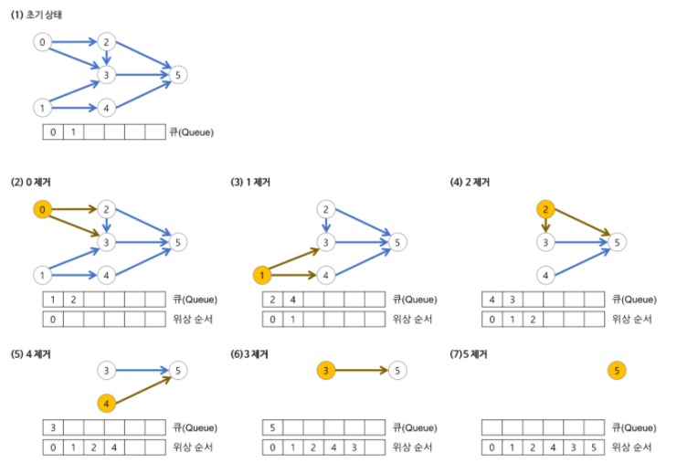

# 위상 정렬(Topological Sort)

- 어떤 일을 하는 순서를 찾는 알고리즘 입니다.
- 방향 그래프에 존재하는 각 정점들의 선행 순서를 위배하지 않으면서 모든 정점을 나열하는 것입니다.
- 하나의 방향 그래프는 여러 위상 정렬이 가능합니다.
- 위상 정렬의 과정에서 선택되는 정점의 순서를 **위상 순서**라고 합니다.
- 위상 정렬 과정에서 그래프에 남아 있는 정점 중에 진입 차수가 0인 정점이 없다면 위상 정렬 알고라즘은 중단되고 위상 정렬이 불가능하게 됩니다.
  - 싸이클 존재x



- 진입 차수가 0인 정점(즉, 들어오는 간선의 수가 0)을 선택합니다.
  - 진입 차수가 0인 정점이 여러 개 존재할 경우 어느 정점을 선택해도 무방하다.
  - 초기에 간선의 수가 0인 모든 정점을 큐에 삽입한다.
- 선택된 정점과 여기에 부속된 모든 간선을 삭제합니다.
  - 선택된 정점을 큐에서 삭제한다.
  - 선택된 정점에 부속된 모든 간선에 대해 간선의 수를 감소시킨다.
- 위의 과정을 반복해서 모든 정점이 선택, 삭제되면 알고리즘을 종료합니다.
- 시간 복잡도 : O(V+E)


- 소스코드 ( 백준 2252 줄 세우기 )

```java
import java.io.BufferedReader;
import java.io.BufferedWriter;
import java.io.IOException;
import java.io.InputStreamReader;
import java.io.OutputStreamWriter;
import java.util.*;

class Main {
	static StringTokenizer st;
	static int n, m;
	static ArrayList<ArrayList<Integer>> list;
	static int[] link;
	static BufferedWriter bw;
	public static void main(String[] args) throws NumberFormatException, IOException {
		
		BufferedReader br = new BufferedReader(new InputStreamReader(System.in));
		bw = new BufferedWriter(new OutputStreamWriter(System.out));
		st = new StringTokenizer(br.readLine());
		n = Integer.parseInt(st.nextToken());
		m = Integer.parseInt(st.nextToken());
		
		// 가중치없는 그래프를 인접리스트로 생성
		list = new ArrayList<>();
		// 간선수까지 기록
		link = new int[n+1];
		for (int i = 0; i <= n; i++) {
			list.add(new ArrayList<>());
		}
		
		for (int i = 0; i < m; i++) {
			st = new StringTokenizer(br.readLine());
			int v1 = Integer.parseInt(st.nextToken());
			int v2 = Integer.parseInt(st.nextToken());
			list.get(v1).add(v2);
			link[v2]++;
		}
		
		topologicalSort();
		
		bw.flush();
		bw.close();
		
	}
	static void topologicalSort() throws IOException {
		Queue<Integer> que = new LinkedList<>();
		
		// 처음에 선행 정점을 가지지 않은 정점을 큐에 삽입
		for (int i = 1; i <= n; i++) {
			if(link[i]==0) que.add(i);
		}
		
		// 정점 수 만큼 반복
		for (int i = 0; i < n; i++) {
			int v = que.poll();
			bw.write(v+" ");
			
			// 뽑은 정점과 연결된 모든 정점의 간선을 감소시킨다.
			for (int j = 0; j < list.get(v).size(); j++) {
				
				int num = list.get(v).get(j);
				link[num]--;
				
				//  간선 감소이후에 더이상 연결된 간선이 없으면 큐에 넣습니다.
				if(link[num] == 0) que.add(num);
				
			}
		}
	}

}
```

